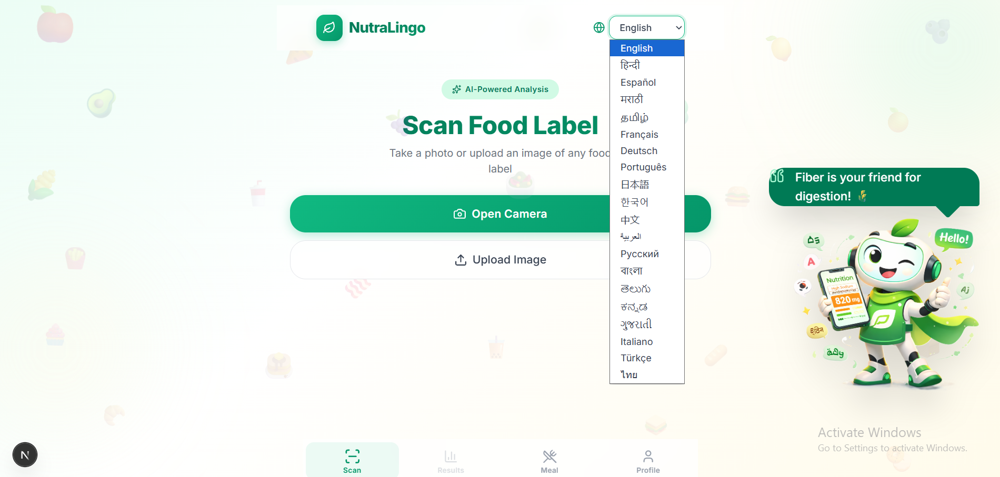
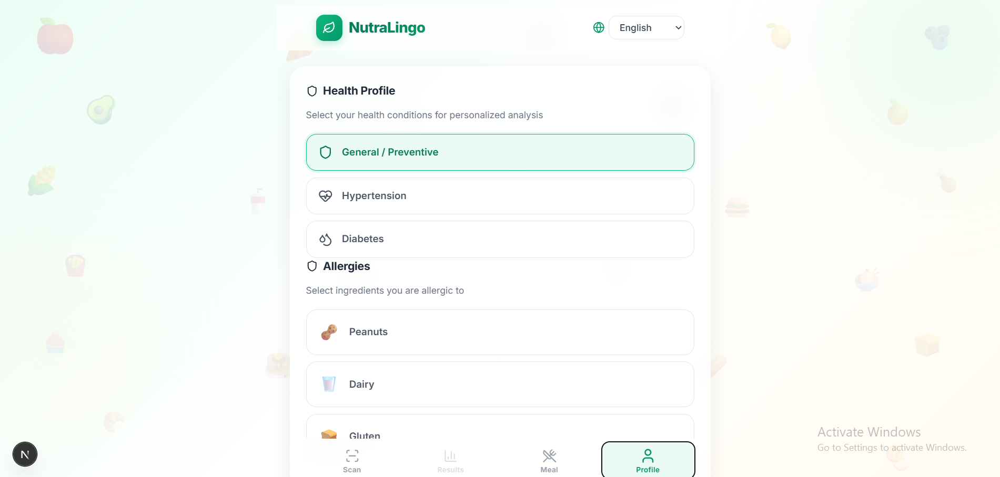
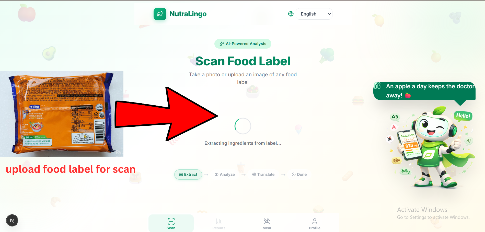
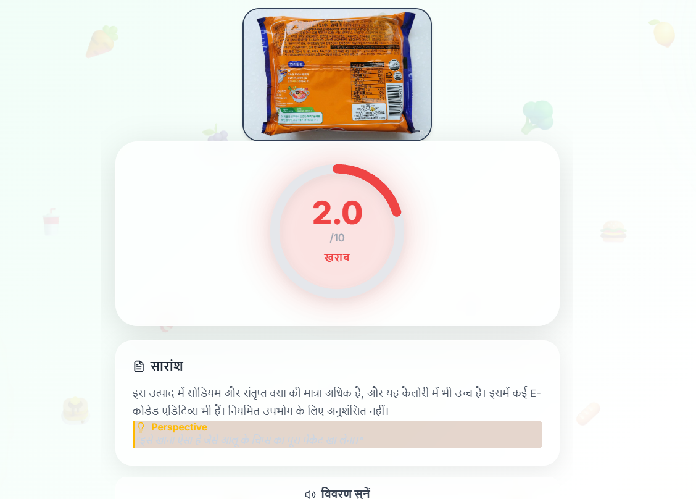
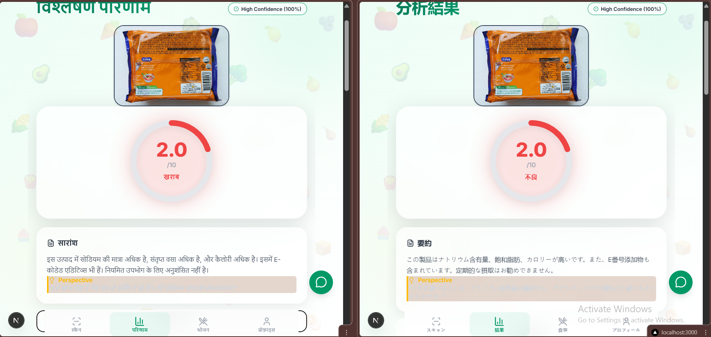
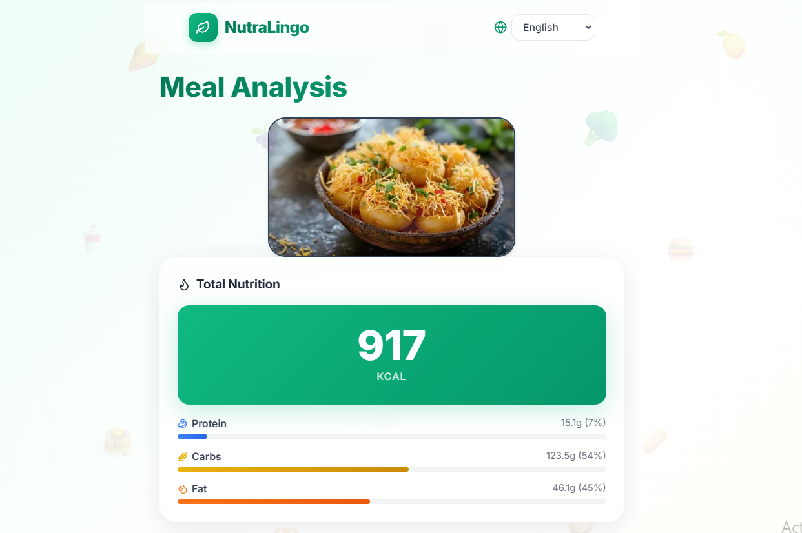
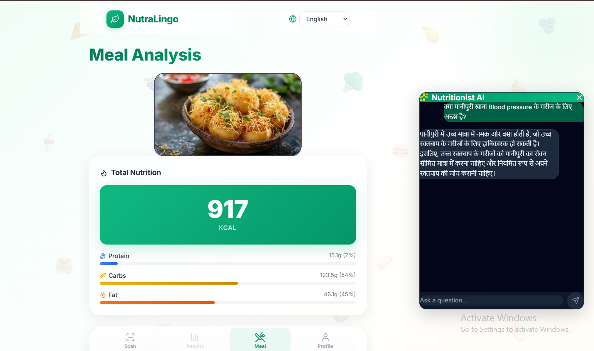

# NutraLingo

**"Your Food Label, Decoded in Your Language."**

🎥 **[Watch the Demo Video of NutraLingo](https://youtu.be/UrWymYM3UTY?si=06P1FU7DaCRPxQ3S)**

NutraLingo is a progressive web application that enables users to scan foreign-language food labels and immediately understand the ingredient risks based on their personal health profile. By leveraging advanced image processing and localization intelligence, it transforms confusing packaging into actionable, native-language health insights.

---

## The Problem

Imagine traveling to a foreign country for work or leisure. You walk into a grocery store to pick up a simple snack. You flip the packet over, but the ingredients and nutritional details are written entirely in a language you do not understand.

If you are generally healthy, this might just be an inconvenience. However, if you are health-conscious, strictly monitoring your diet, or managing a condition like hypertension or diabetes, this lack of clarity is a severe health risk.

Literal translation tools are insufficient for this scenario. Direct translation of technical or localized terms often loses critical medical context. Furthermore, understanding the raw translation of an ingredient does not explain its health implication for your specific dietary restrictions. Language barriers in the context of food consumption create genuine health hazards that standard translation APIs cannot resolve.

---

## The Solution – NutraLingo

NutraLingo bridges the gap between foreign packaging and personal health. 

- **Label Extraction:** Instantly parses multi-language nutritional tables via camera.
- **Health Reasoning:** Evaluates data against nutritional baselines to identify hidden risks (e.g., high sodium, trans fats).
- **Personalized Interpretation:** Cross-references the analysis with the user's logged health profile.
- **Multilingual Localization:** Safely translates complex medical intent into the user's native language using Lingo.dev.
- **AI Assistant:** An interactive chat to ask follow-up questions about specific ingredients.

---

## Execution of NutraLingo (Step-by-Step Walkthrough)

### Step 1 – Home Interface
The user entry point is designed for immediate action. The interface prioritizes camera accessibility and file upload functionality, allowing users to scan packaging rapidly with one hand while on the go.



### Step 2 – User Health Profile
Before scanning, users input their specific health constraints. This includes logging allergens, current age, and chronic conditions such as high blood pressure or diabetes. This personalization logic ensures that all subsequent health analyses are conditional to the specific individual, rather than generic dietary advice.



### Step 3 – Food Label Scan
The system executes a multi-stage image processing pipeline. Upon capturing the image, optical character recognition (OCR) extracts the raw text. A structured data parsing mechanism then identifies and categorizes the ingredient list, nutritional table, and serving sizes.



### Step 4 – Health Analysis Report
NutraLingo generates a comprehensive analysis dashboard. A prominent dial displays the overall Health Score indicating safety. The report breaks down the nutritional composition, visually highlighting risky ingredients in red and safe ingredients in green, accompanied by a personalized risk interpretation based on the user's logged conditions.



### Step 5 – Localization Intelligence (CRITICAL SECTION)
This is where NutraLingo connects data to understanding. Using Lingo.dev, the platform localizes the highly technical health interpretation into the user's native language. Unlike simple translation APIs, Lingo.dev ensures **intent-preserving localization**. It adapts the medical tone to remain accurate yet accessible, adjusts for cultural naming conventions of ingredients, and prevents catastrophic mistranslations that often occur when directly converting medical terminology. 



### Step 6 – Meal Scanning Feature
Beyond packaged food, NutraLingo offers a meal scanning capability. Users can capture an image of a prepared plate. The system estimates the macronutrient breakdown and potential hidden risks of the meal, running the same health interpretation logic to advise the user before they eat.



### Step 7 – AI Assistant
For users requiring deeper insights, an interactive AI assistant is integrated into the report. Users can ask specific follow-up questions (e.g., "Why is soy lecithin bad for me?"). The assistant provides simplified interpretations and user guidance, maintaining the chosen language and localized tone.




---

## Technical Highlight (Core Logic)

NutraLingo relies on intent-preserving localization to function safely in a medical context.

### Localization Intelligence (Lingo.dev)
Standard translation APIs break medical context. NutraLingo uses Lingo.dev's object localization to translate complex nested JSON reports while strictly preserving the medical intent and structural integrity of the warnings.

```javascript
// /backend/src/services/lingoService.js
const { LingoDotDevEngine } = require('lingo.dev/sdk');

const lingoDotDev = new LingoDotDevEngine({ apiKey: process.env.LINGO_API_KEY });

async function localizeReport(healthReport, targetLanguage) {
    if (targetLanguage === 'en') return { localizedReport: healthReport };

    // Build the object to localize — user-facing text and specific warnings
    const contentToLocalize = {
        verdict: healthReport.verdict,
        summary: healthReport.summary,
        // Mapping warnings array into flat structure for safe localization
        ...healthReport.warnings.reduce((acc, w, i) => {
            acc[`w${i}_risk`] = w.risk;
            return acc;
        }, {})
    };

    // Lingo.dev SDK — localizeObject preserves structure, intent, and medical tone
    const translated = await lingoDotDev.localizeObject(contentToLocalize, {
        sourceLocale: 'en',
        targetLocale: targetLanguage,
    });

    return { localizedReport: reconstructReport(healthReport, translated) };
}
```

---

## Getting Started (How to Run Locally)

To run NutraLingo on your local machine for evaluation:

### Prerequisites
- Node.js (v18+)
- npm or yarn

### 1. Clone the Repository
```bash
git clone https://github.com/yourusername/NutraLingo.git
cd NutraLingo
```

### 2. Setup the Backend
```bash
cd backend
npm install
```
Create a `.env` file in the `backend` directory with the following keys:
```env
PORT=5000
GROQ_API_KEY=your_groq_api_key
LINGO_API_KEY=your_lingo_dev_api_key
GEMINI_API_KEY=your_gemini_api_key
```
Start the backend server:
```bash
npm run dev
```

### 3. Setup the Frontend
Open a new terminal window:
```bash
cd frontend
npm install
```
Create a `.env.local` file in the `frontend` directory:
```env
NEXT_PUBLIC_API_URL=http://localhost:5000/api
```
Start the frontend development server:
```bash
npm run dev
```
NutraLingo will now be running on `http://localhost:3000`.

---

## Technical Architecture

NutraLingo operates on a robust data and processing pipeline:

**User Input** → **Image Capture** → **Gemini Vision OCR** → **Structured JSON** → **Health Reasoning Engine** → **Lingo.dev Localization** → **Localized UI & Voice**

1. The frontend progressive web app (PWA) handles image acquisition.
2. The Node.js backend processes the image using Gemini Vision for text extraction.
3. A reasoning layer structures the data and cross-references it with user restrictions via an LLM.
4. Lingo.dev safely localizes the medical interpretation before responding to the client.

---

## Tech Stack

- **Frontend:** Next.js (PWA enabled), TailwindCSS
- **Backend:** Node.js, Express
- **OCR & Extraction:** Gemini Vision API
- **Reasoning LLM:** Groq (Llama 3)
- **Localization Layer:** Lingo.dev API
- **Voice System:** Native Web Speech / TTS

---

## Why Lingo.dev Is Core to NutraLingo

NutraLingo is not a translation application; it is a health intelligence system. The dependency on Lingo.dev is foundational because standard machine translation is inherently dangerous in a medical context.

1. **Intent Preservation:** Medical translation requires intent preservation. Translating "sodium nitrate" literally might yield an accurate linguistic match but fails to convey its function as an additive with blood pressure implications. Lingo.dev ensures the functional intent of the explanation survives the translation.
2. **Cultural Nuance:** Dietary norms and ingredient terminologies vary aggressively across cultures. Lingo.dev handles these nuances so that local terms make sense to the end-user.
3. **Failure of Standard APIs:** Standard translation APIs lack the contextual awareness to adjust for health profiles. They prioritize syntax over safety.
4. **Safe Localization:** Lingo.dev enables NutraLingo to confidently push critical health data in multiple languages, knowing the medical tone and risk severity will remain consistent across language barriers.

---

## Future Enhancements

- **Offline Caching:** Allowing traveler usage in areas with poor cellular reception.
- **Dedicated Allergen Detection Module:** Immediate, full-screen red-flag alerts specifically for severe allergens before further processing.
- **QR Emergency Card:** A localized digital card summarizing user conditions for foreign emergency responders.

---

## Conclusion

NutraLingo eliminates the health risks caused by language barriers and transforms foreign food packaging into personalized health intelligence—in any language.
